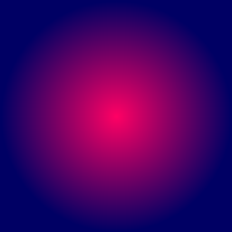
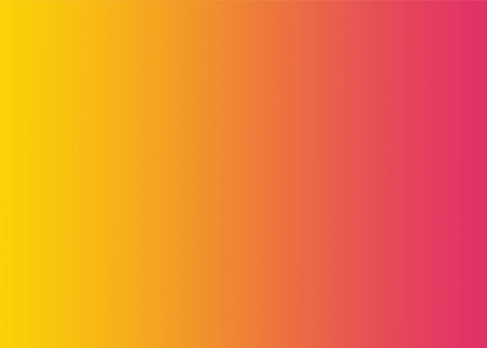
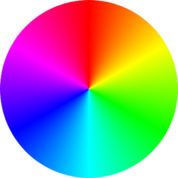
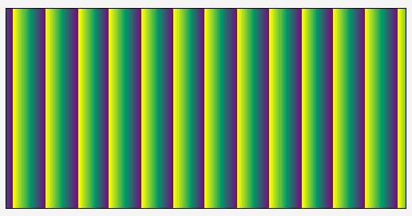

# FARBEN & VERLÄUFE

## **_Farben_**

# In CSS können **_farben_** auf verschiedene wege definiert werden

- color Name
  - CSS unterstützt 140 Standardfarbnamen.
- mit RGB werte.
-       - blue, lightskyblue, usw.
  - **rgb( RED , GREEN , BLUE )**. Jeder Parameter definiert die Intensität der Farbe als ganze Zahl zwischen 0 und 255.
- hexadecimal Wert
  - **#RRGGBB**.RR (Rot), GG (Grün) und BB (Blau) sind hexadezimale Ganzzahlen zwischen 00 und FF, die die Intensität der Farbe angeben.Beispielsweise wird # 0000FF blau angezeigt, da die blaue Komponente auf ihren höchsten Wert (FF) gesetzt ist und die anderen auf 00 gesetzt sind.
- HSL values

  - HSL-Farbwerte werden angegeben mit:hsl(hue, saturation, lightness).

        -Der **HUE** ist ein Grad auf dem Farbrad von 0 bis 360. 0 ist rot, 120 ist grün, 240 ist blau.

        -Die **SATURATION** ist ein Prozentwert; 0 % bedeutet einen Grauton und 100 % ist die volle Farbe.

        - Das ** LIGHTNESS** ist auch ein Prozentsatz; 0 % ist schwarz, 100 % ist weiß.

- **currentcolor** wert - Das Schlüsselwort currentcolor bezieht sich auf den Wert der Farbeigenschaft eines Elements. - .container{
  color: gray;
  border: 10px solid currentcolor;
  }_/ das gleiche farbe_/

## **_Verläufe_**

- background-image: gradient erzeugt einen Verlauf (einen weichen Übergang zwischen zwei oder mehr Farben) rein auf der Basis von HTML und CSS als Hintergrund.Der Verlauf folgt einer gedachte Linie von Farb-Stops (Color Stops).
- Es gibt vier Formen des CSS-Gradient:

  - **radial Gradient**
    

        -   radial-gradient( circle,purple, blue);

  - **linear Gradient**
    

          -  linear-gradient(to left , yellow, 60% );

  - **conic Gradient**
    

            -   div.conic-gradient {width: 300px; height: 300px; border-radius: 50%; background: conic-gradient(red, yellow, lime, aqua, blue, magenta, red);}

  - **repeat linear/radial Gradient**
    
    

    -     .gradient1{repeating-linear-gradient(to right, yellow 10px, #009966, purple 50px;}
    -     .gradient2{repeating-radial-gradient(circle, yellow 10px, #009966, purple 50px);}

- Ein Gradient oder Verlauf ist eine gedachte Linie, auf der Farbunterbrechungen (Color Stops) liegen. Im einfachsten Fall gibt es zwei Farbunterbrechungen in einem Verlauf. An jedem Color Stop beginnt eine Farbe, die bis zum nächsten Color Stop in die andere Farbe verläuft.
-       - background-image: linear-gradient(to top, white 0%, black 50%)
        - background-image: linear-gradient(to right, white 0%, black 60%)
        - background-image: linear-gradient(45deg, white 0%, black 70%)

### **_HIER_** => [ Online Gradient Generator ](https://cssgradient.io/)

### **HIER**=> [ Documentation ](https://developer.mozilla.org/en-US/docs/Web/CSS/CSS_Images/Using_CSS_gradients)

### **HIER**=> [Die Beste Erklärung](https://www.youtube.com/watch?v=4kWHW7da4U8)
